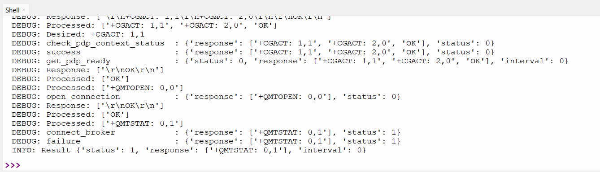

# Week 6 Report

## Tasks and Progress Status

### 1. Factoring and Pushing the Code
- The `hivemq.py`, `mqtt_publish.py`, and `mqtt_subscribe.py` codes were formatted according to PEP8 format using BlackFormatter.
- Docstrings were written for functions.
- An import line necessary for integrating HiveMQ Cloud support was added to the `core.py` file.
- `hivemq.py`, `mqtt_publish.py`, and `mqtt_subscribe.py` were added to the pico_lte_micropython-sdk repository.

### 2. Problems
- The `mqtt_publish.py` code was executed, and a '+QMTSTAT: 0,1' error was received. Debug mode was activated, and the error message was traced back to the mqtt.connect_broker function. Research was conducted for a solution, and it was found in the modem's "BG96 MQTT Application Note" document that the error message means "Connection is closed or reset by peer." The document suggested "Execute AT+QMTOPEN command and reopen MQTT connection" as a solution, but no action has yet been taken to resolve the error.

- The `mqtt_subscribe.py` code was executed, and a 'KeyError: deactivate_pdp_context' error was received. However, no action has yet been taken to resolve the issue.

